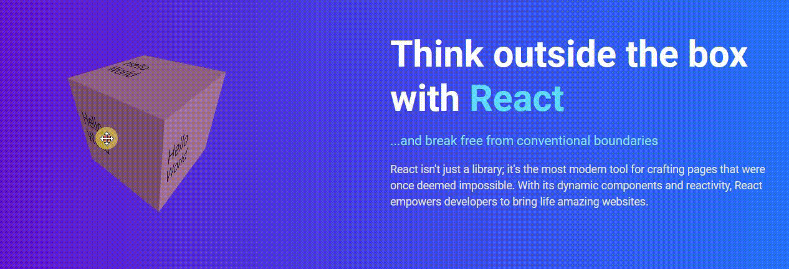
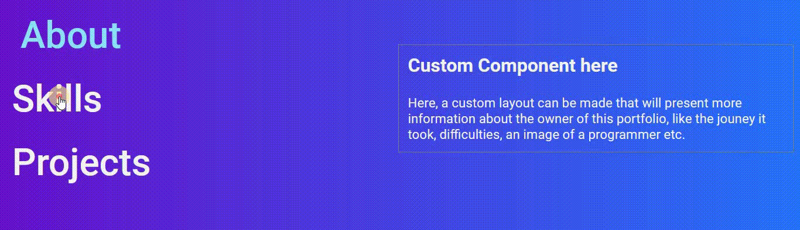
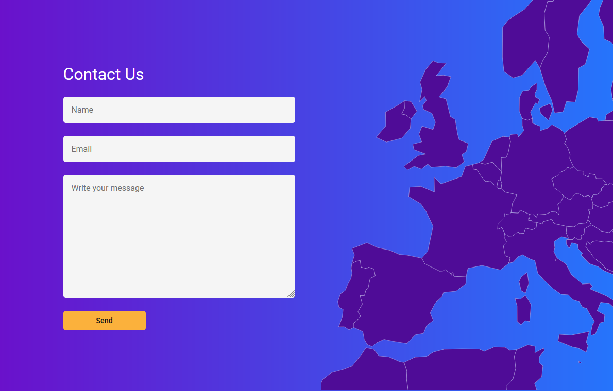

# 🛠 Three.js & React - customizable portfolio

# 🔗 [Live Preview](https://main--zippy-pudding-c11fa4.netlify.app/)

# Welcome! 👋

- I made a customizable Portfolio example using 3D objects from Three.js and React as a basis. The exercise here was to get introduced to Three.js and how 3D objects can be integrated into a project. This project was originally made here ("https://youtu.be/qALsVa-V9qo") but in order to add a personal touch and not just copy everything I modified it according to my opinion both in code and design. it features:

1. Hero section 
2. Intro section with 3d box that can be played with by the user. 
3. About section in which skills, projects,  experience and overall more information about the owner of the portfolio can be displayed through conditionally rendered components. 
4. Contact section with a contact form that is not operational and a map of the world. The easy way to make the form operational without a backend would be through online services like "Form Submit" ("https://formsubmit.co/")
---

### Languages and features 👨‍💻 

- Three.js: canvas, meshes etc...
- React: local state management, conditional rendering, if statements
- "Styled components" are used for styling in this project

Thanks for checking out my projects.
